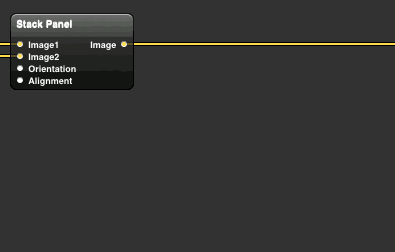

# Stack Panel

A macro patch, named after Sytem.Windows.Controls.StackPanel, which stacks two images horizontally or vertically.

## License

* AGPL v3
* Other licensing options may be added in the future.

## Install

Copy StackPanel.qtz to `~/Library/Graphics/Quartz Composer Patches`.

## Uninstall

Delete `~/Library/Graphics/Quartz Composer Patches/StackPanel.qtz`.

*NOTE: Compositions using the macro patch will be broken.*

## Known Issues

* Users of Radeon HD-equipped Macs may experience artifacts in the resulting image with GenericGray-colorspace inputs.
    * You can check if this applies to your Mac by feeding a `Composite` or `Source Over` patch with an `Image With String` patch.
    * To avoid artifacts, switch to the integrated GPU using Quartz Debug and restart Quartz Composer.

## Input Parameters

* __Image1__
    * The image to be positioned left or bottom.
* __Image2__
    * The image to be positioned right or top.
* __Orientation__
    * Stacking orientation.
    * *Horizontal*: Image1 to the left, Image2 to the right.
    * *Vertical*: Image1 to the bottom, Image2 to the top.
* __Alignment__
    * Align images when they have different width (in vertical stacking) or heights (in horizontal stacking).
    * *Left / Bottom*: Images will be aligned to the left when stacked vertically, to the bottom when stacked horizontally.
    * *Center*: Images will be centered horizontally (in vertical stacking) or vertically (in horizontal stacking).
    * *Right / Top*: Images will be aligned to the right when stacked vertically, to the top when stacked horizontally.

## Q&A

### Why do you place Image1 below Image2?

Just to conform to the nature of Quartz Composer's coordinate system where the X axis runs left to right and the Y axis runs bottom to top.